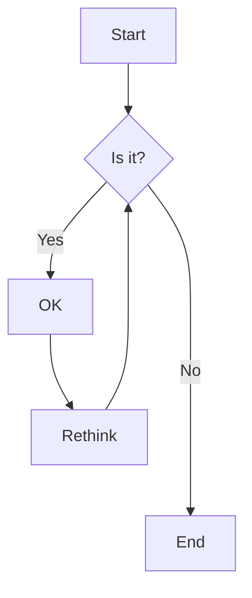

import { Scrollycoding } from "@/components/scrollycoding";

## test

description

<Scrollycoding>

# !!steps 第一步

步骤描述

- 描述 1
- 描述 2

{/* prettier-ignore */}
```js ! george.js
// !callout[/houses/] 关于 houses 的描述
const houses = [
  "Stark",
  "Lannister",
  "Baratheon",
  "Targaryen",
]

const winner =
  houses[
    Math.floor(
      Math.random() * houses.length,
    )
  ]

console.log(`Iron Throne: ${winner}`)
```

# !!steps 测试 markdown

步骤描述

| 列 1     |     列 2     |     列 3 |
| -------- | :----------: | -------: |
| ~左对齐~ | **居中对齐** | `右对齐` |



```js ! george.js
const houses = [
  "Stark",
  "Lannister",
  "Baratheon",
  "Targaryen",
  "Martell",
  "Tyrell",
  "Greyjoy",
];

const keepDreaming = () => {
  return "Not gonna happen...";
};

console.log(keepDreaming());
```

</Scrollycoding>


```js george.js
function lorem(ipsum, dolor = 1) {
  const sit = ipsum == null ? 0 : ipsum.sit;
  // !diff -
  dolor = ipsum - sit;
  // !diff +
  dolor = sit - amet(dolor);
  return sit ? consectetur(ipsum) : [];
}
```

```js george.js
function lorem(ipsum, dolor = 1) {
  // !className line-through
  const sit = ipsum == null ? 0 : ipsum.sit;
  dolor = sit - amet(dolor);
  // !className[/sit/] bg-red-700 rounded-lg px-1
  return sit ? consectetur(ipsum) : [];
}
```

```js george.js
function lorem(ipsum, dolor = 1) {
  const sit = ipsum == null ? 0 : ipsum.sit;
  dolor = sit - amet(dolor);
  return sit ? consectetur(ipsum) : [];
}

function ipsum(ipsum, dolor = 1) {
  return dolor;
}

// !focus(1:5)
function dolor(ipsum, dolor = 1) {
  const sit = ipsum == null ? 0 : ipsum.sit;
  dolor = sit - amet(dolor);
  return sit ? consectetur(ipsum) : [];
}
```

## testaa

<Cards>
  <Card title="Learn more about Code Hike" href="https://codehike.org/docs" />
  <Card title="Learn more about Fumadocs" href="https://fumadocs.vercel.app" />
</Cards>
