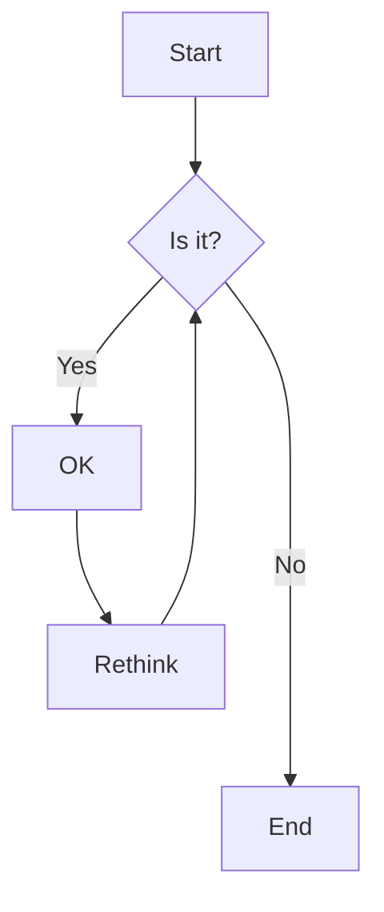

import { Scrollycoding } from "@/components/scrollycoding";
import { InlineCode } from "@/components/code";

## 代码渲染

**非**行内渲染代码: `var x = 10`

行内渲染代码: _`var x = 10`_

<Scrollycoding>

## 分步展示

# !!steps 第一步

气泡式注释

{/* prettier-ignore */}
```js ! george.js
// !callout[/houses/] 关于 houses 的描述
const houses = [
  "Stark",
  "Lannister",
  "Baratheon",
  "Targaryen",
]
```

# !!steps 第二步

简单演示代码过渡动画

```js ! george.js
const houses = [
  "Stark",
  "Lannister",
  "Baratheon",
  "Targaryen",
  "Martell",
  "Tyrell",
  "Greyjoy",
];

const keepDreaming = () => {
  return "Not gonna happen...";
};

console.log(keepDreaming());
```

# !!steps 第三步

展示代码对比

```js ! george.js
function lorem(ipsum, dolor = 1) {
  const sit = ipsum == null ? 0 : ipsum.sit;
  // !diff -
  dolor = ipsum - sit;
  // !diff +
  dolor = sit - amet(dolor);
  return sit ? consectetur(ipsum) : [];
}
```

# !!steps 第四步

展示代码样式

```js ! george.js
function lorem(ipsum, dolor = 1) {
  // !className line-through
  const sit = ipsum == null ? 0 : ipsum.sit;
  dolor = sit - amet(dolor);
  // !className[/sit/] bg-red-700 rounded-lg px-1
  return sit ? consectetur(ipsum) : [];
}
```

# !!steps 第五步

展示代码边框

```js ! george222.js
// !border(1:3)
function lorem(ipsum, dolor = 1) {
  const sit = ipsum == null ? 0 : ipsum.sit;
  dolor = sit - amet(dolor);
  return sit ? consectetur(ipsum) : [];
}

// !bg[1:8] #E0F3AC
function ipsum(ipsum, dolor = 1) {
  return dolor;
}

// !focus=5 !mark=4[2:6]
function dolor(ipsum, dolor = 1) {
  const sit = ipsum == null ? 0 : ipsum.sit;
  dolor = sit - amet(dolor);
  return sit ? consectetur(ipsum) : [];
}
```

</Scrollycoding>

## 测试 markdown

| 列 1     |     列 2     |     列 3 |
| -------- | :----------: | -------: |
| ~左对齐~ | **居中对齐** | `右对齐` |

## 测试 mermaid



<Cards>
<Card title="MDX 支持一览" href="https://fumadocs.vercel.app/docs/ui/markdown">

</Card>
</Cards>
