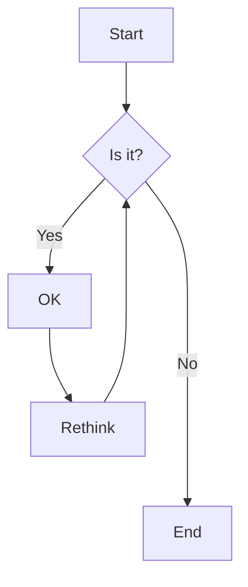

import { ScrollTabCoding } from "@/components/code-blocks/ScrollyTabCoding";



<ScrollTabCoding>

## !!steps A Clash of Kings

sdfasdfasdfasdffwe
sdfasdfasdfasdffwe
sdfasdfasdfasdffwef

sdfasdfasdfasdfsdf

sdfasdfasdfasdfsdf
sdfasdfasdfasdf
sdfasdfasdfasdf

sfsdf

```typescript !!tabs throttle.ts
/**
 * 节流函数 - 限制函数在一定时间内只能执行一次
 * @param fn 需要节流的函数
 * @param minInterval 最小执行间隔时间(毫秒),默认1000ms
 * @param options 配置选项
 * @param options.leading 是否在延迟开始前执行
 * @param options.trailing 是否在延迟结束后执行
 * @returns 经过节流处理的函数
 */
export function throttle<T extends unknown[]>(
  fn: (...args: T) => unknown,
  minInterval = 1000,
  options = {
    leading: false,
    trailing: false,
  }
) {
  // 是否是第一次调用的标志
  let first = true;
  // 上次执行时间
  let lastCallTime = Date.now();
  // 定时器引用
  let timer: ReturnType<typeof setTimeout>;

  return function (this: unknown, ...args: T) {
    // 当前时间
    const curTime = Date.now();
    const { leading, trailing } = options;

    // 清除之前的定时器
    if (timer) {
      clearTimeout(timer);
    }

    // 首次调用的特殊处理，避免 leading 和 trailing 同时为 true 时执行两次
    if (first) {
      if (leading) {
        // leading为true时立即执行
        fn.apply(this, args);
        lastCallTime = curTime;
      } else if (trailing) {
        // trailing为true时延迟执行
        timer = setTimeout(() => {
          fn.apply(this, args);
          lastCallTime = curTime;
        }, minInterval);
      }
      first = false;
      return;
    }

    // 判断是否超过最小间隔时间
    if (curTime - lastCallTime > minInterval) {
      fn.apply(this, args);
      lastCallTime = curTime;
    }

    // trailing为true时,设置定时器在间隔结束后执行
    if (trailing) {
      timer = setTimeout(() => {
        fn.apply(this, args);
        lastCallTime = curTime;
      }, minInterval);
    }
  };
}
```

```typescript !!tabs debounce.ts
type Option = {
  // 首次触发后是否执行
  leading: boolean;
  // 函数执行的间隔
  callInterval: number;
  // 最后一次触发是否执行
  trailing: boolean;
};

export function debounce<T extends unknown[]>(
  fn: (...args: T) => unknown,
  // 请求调用的间隔
  reqInterval = 3000,
  options: Option = {
    leading: true,
    callInterval: Infinity,
    trailing: true,
  }
) {
  let first = true;
  let lastCallTime: number = new Date().getTime();
  let lastReqTime: number = lastCallTime; // 初始化 lastReqTime
  let timer: ReturnType<typeof setTimeout>;

  const { leading, callInterval, trailing } = options;

  return function (this: unknown, ...args: T) {
    const curTime = new Date().getTime();

    // 清除之前的定时器
    if (timer) {
      clearTimeout(timer);
    }

    // 计算时间间隔
    const sinceLastReq = curTime - lastReqTime;
    const sinceLastCall = curTime - lastCallTime;

    // 更新最后请求时间
    lastReqTime = curTime;

    // 首次调用
    if (first) {
      if (leading) {
        lastCallTime = curTime;
        fn.apply(this, args);
      }
      first = false;
    }
    // 非首次调用
    else if (
      sinceLastReq > reqInterval || // 距离上次请求超过间隔
      sinceLastCall > callInterval // 距离上次执行超过最小间隔
    ) {
      lastCallTime = curTime;
      fn.apply(this, args);
    }

    // 设置trailing调用
    if (trailing) {
      timer = setTimeout(() => {
        const now = new Date().getTime();
        // 确保和上次执行间隔足够
        if (now - lastCallTime >= callInterval) {
          lastCallTime = now;
          fn.apply(this, args);
        }
      }, reqInterval);
    }
  };
}
```

## !!steps tttttt

A Cla

```python !!tabs test
def factorial(n):
    if n == 0:
        return 1
    else:
        return n * factorial(n - 1)
```

## !!steps vvvvvv

A Cla

```python !!tabs test
def factorial(n):
    if n == 0:
        return 8
    else:
        return n * factorial(n - 1)
```

## !!steps bbbbbb

A Cla
sdfasdfasdfasdffwe
sdfasdfasdfasdffwe
sdfasdfasdfasdffwef

sdfasdfasdfasdfsdf

sdfasdfasdfasdfsdf
sdfasdfasdfasdf
sdfasdfasdfasdf

sfsdf

```python !!tabs test
import asyncio
import inspect
import re
from functools import wraps


def async_to_sync(func):
    @wraps(func)
    def wrapper(*args, **kwargs):
        if asyncio.iscoroutinefunction(func):
            try:
                loop = asyncio.get_running_loop()
            except RuntimeError:
                loop = asyncio.new_event_loop()
                asyncio.set_event_loop(loop)
            return loop.run_until_complete(func(*args, **kwargs))
        else:
            return func(*args, **kwargs)

    return wrapper
```

</ScrollTabCoding>

## jowjfoijwoef

sdfasdfawewcf

- 1: sdfasdfasdfasdf
- 2: sdfasdfasdfasdf
- 3: sdfasdfasdfasdf
