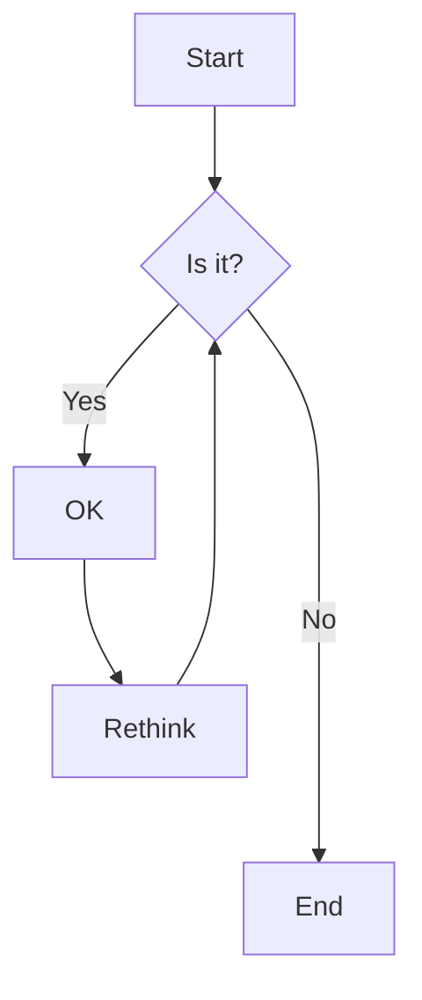

import { ScrollTabCoding } from "@/components/code-blocks/ScrollyTabCoding";



<ScrollTabCoding>

## !!steps A Clash of Kings

A Clash of Kings

```scala !!tabs test
object Main {
  def factorial(n: Int): Int = {
    if (n == 0) {
      return 1
    } else {
      return n * factorial(n - 1)
    }
  }
}
```

```python !!tabs test2
def factorial(n):
    if n == 0:
        return 1
    else:
        return n * factorial(n - 1)
```

## !!steps tttttt

A Cla

```python !!tabs test
def factorial(n):
    if n == 0:
        return 1
    else:
        return n * factorial(n - 1)
```

</ScrollTabCoding>

## jowjfoijwoef

sdfasdfawewcf

- 1: sdfasdfasdfasdf
- 2: sdfasdfasdfasdf
- 3: sdfasdfasdfasdf
