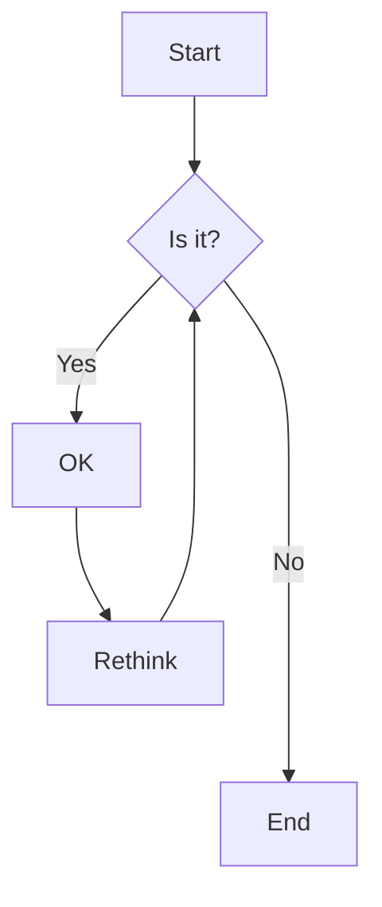

import { ScrollTabCoding } from "@/components/code-blocks/ScrollyTabCoding";



<ScrollTabCoding>

## !!steps A Game of Thrones

- 1: sfasdfjosfiwjof
- 2: sdfasdfasdfasdf
- 3: sdfasdfasdfasdf

{/* prettier-ignore */}
```js !!tabs main.js
function lorem(ipsum, dolor = 1) {
  const sit = ipsum == null ? 0 : ipsum.sit;
  dolor = sit - amet(dolor);
  return sit ? consectetur(ipsum) : [];
}
```

```css !!tabs styles.css
body {
  margin: 0;
  padding: 0;
}
```

## !!steps A Clash of Kings

A Clash of Kings, the second book in the series, continues the epic saga. The Seven Kingdoms are plunged into war, with kings rising and falling. Meanwhile, Daenerys Targaryen seeks to return to Westeros with her growing dragons.

```js !!tabs main.js
function lorem(ipsum, dolor = 1) {
  const sit = ipsum == null ? 0 : ipsum.sit;
  dolor = sit - amet(dolor);
  return sit ? consectetur(ipsum) : [];
}
// sfasdfjosfiwjof
```

```css !!tabs styles.css
body {
  margin: 1;
  padding: 100;
}
```

## !!steps tttttt

A Cla

```js !!tabs main.js
function lorem(ipsum, dolor = 1) {
  const sit = ipsum == null ? 0 : ipsum.sit;
  dolor = sit - amet(dolor);
  return sit ? consectetur(ipsum) : [];
}
// sfasdfjosfiwjof
```

```css !!tabs styles2.css
body {
  margin: 10000;
  padding: 100000;
}
```

</ScrollTabCoding>

## jowjfoijwoef

sdfasdfawewcf

- 1: sdfasdfasdfasdf
- 2: sdfasdfasdfasdf
- 3: sdfasdfasdfasdf
